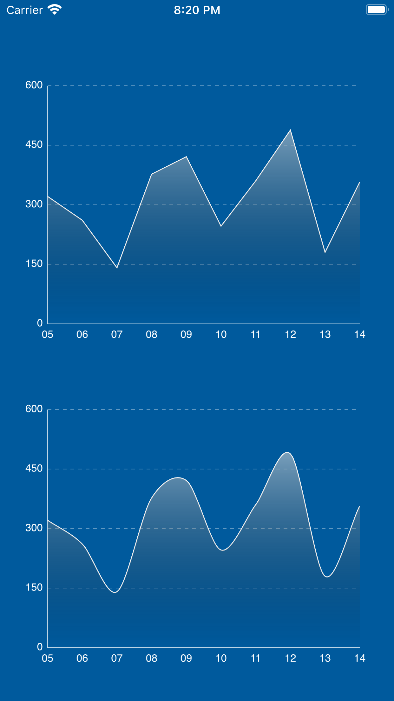

# LineChart
A fork of the original [nhatminh12369/LineChart](https://github.com/nhatminh12369/LineChart), modified to personal needs. It doesn't use a ScrollView, has the possibility to show label for the selected item in the chart and offers more customization options.

# Demo

# Authors
Pascal Kimmel, development@tapplion.com and the original author, Minh Nguyen.

# License
LineChart is available under the MIT license. See the LICENSE file for more info.
